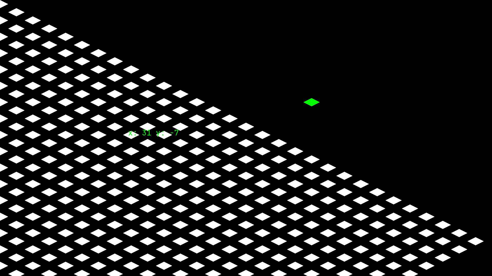
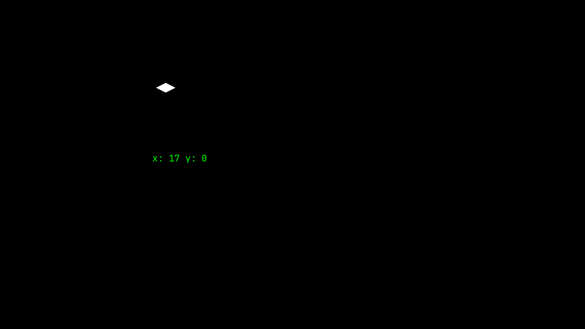
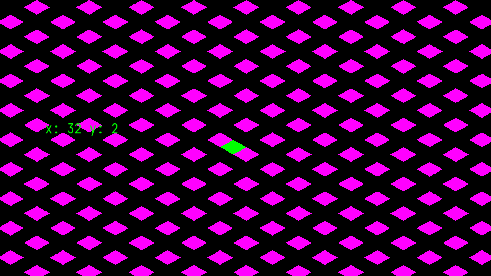

# SFML Isometric Grid Demo

A simple interactive demo showcasing isometric grid movement using SFML.



## Features
- Diamond-shaped isometric tile rendering
- Grid-to-screen coordinate conversion
- Keyboard-controlled movement (Arrow Keys)
- Real-time coordinate display

## Requirements
- SFML 2.5+
- C++17 compiler
- Make

## Installation & Usage
```bash
# Clone the repository
git clone https://github.com/yourusername/sfml-isometric-demo.git
cd sfml-isometric-demo

# Compile and run
make && ./sfml-app
```

## Evolution

### Stage 1
- single moving tile


### Stage 2
- add a binary color grid map


### Stage 3
- add a zoomed view dead center
